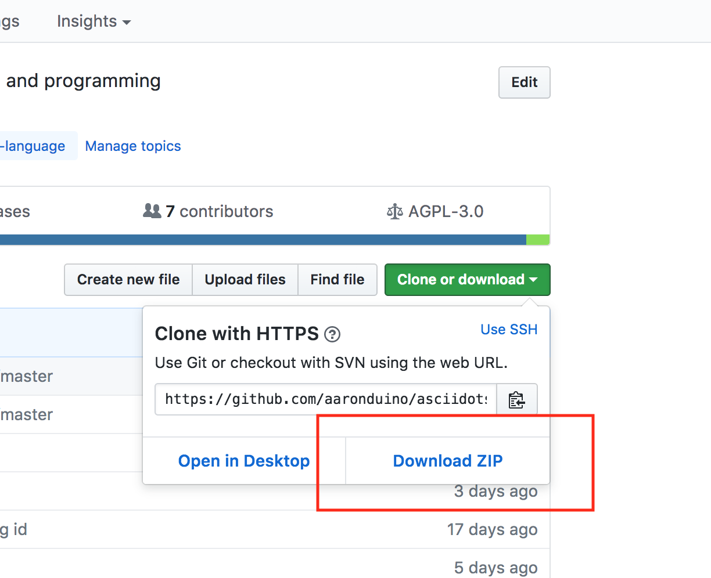

# Getting Started

Welcome to AsciiDots!

## Installation

**Using pip (python 3)** (recommended):

```
pip install asciidots
```

**Using Docker Hub** (recommended):

Run sample program from this repo:
```
docker run -ti --rm aaronduino/asciidots samples/hello_world.dots
```

Run local file `test.dots`:
```
docker run -ti --rm -v $PWD:/data aaronduino/asciidots /data/test.dots
```

**Using Local Dockerfile**:  

Build the image:
```
docker build -t asciidots ./docker
```

Run sample program from this repo:
```
docker run -ti --rm asciidots samples/hello_world.dots
```

Run local file `test.dots`:
```
docker run -ti --rm -v $PWD:/data asciidots /data/test.dots
```

**From source**:

Requirements:
- Python 3

_Download_:

With Git:

```
git clone https://github.com/aaronduino/asciidots
```

Without git:

Just download the zip from the Github page, and unzip it


_Install_:
```
pip install -r requirements.txt
```

_Run it from source using python 3_:
```
python __main__.py [arguments]
```

or alias it to `asciidots` using:
```
echo "alias asciidots='python $(pwd)/__main__.sh'" >> ~/.bash_profile
source ~/.bash_profile
```

## Running
You can simply run a program with:

```
$ asciidots [asciidots file to run]
```

You can read more about running AsciiDots programs on the [interpreter guide](interpreter.html)

## Quick sample programs to try out

If you just want to run a fun sample program, I suggest running the counter in debug mode:

```
$ asciidots samples/counter.dots -y -d -a 0.02
```

If you want something more complex, try this:

```
$ asciidots samples/find_primes.dots -d -a 0.02
```

## Programming in AsciiDots
Read the [language guide & docs page](language.html) for a friendly and informative guide to programming in AsciiDots.
