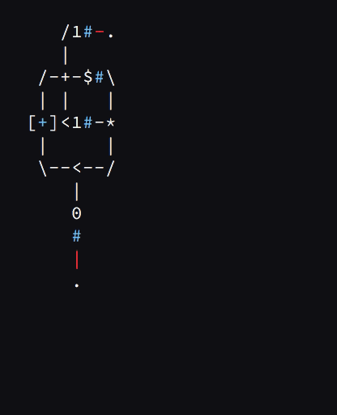

# AsciiDots - Esoteric Language
> The esolang inspired by ascii art
```
                   _ _ _____        _       
    /\            (_|_)  __ \      | |      
   /  \   ___  ___ _ _| |  | | ___ | |_ ___
  / /\ \ / __|/ __| | | |  | |/ _ \| __/ __|
 / ____ \\__ \ (__| | | |__| | (_) | |_\__ \
/_/    \_\___/\___|_|_|_____/ \___/ \__|___/

```

[](https://codebeat.co/projects/github-com-aaronduino-asciidots-master)
[](https://gitter.im/asciidots/Lobby?utm_source=badge&utm_medium=badge&utm_campaign=pr-badge&utm_content=badge)

> Featured on [Hacker News](https://news.ycombinator.com/item?id=14947449), [Motherboard](https://motherboard.vice.com/en_us/article/a33dvb/asciidots-is-the-coolest-looking-programming-language) ([slashdot comments](https://developers.slashdot.org/story/17/08/13/2033239/new-asciidots-programming-language-uses-ascii-art-and-python)), and [i-programmer](http://www.i-programmer.info/news/98-languages/11115-asciidots-a-language-like-a-racetrack.html).

AsciiDots is an esoteric programming language based on ascii art. In this language, _dots_, represented by periods (`.`), travel down ascii art paths and undergo operations.

[](http://aaronduino.github.io/asciidots/demo.html?code=%20%20%20%20%2F1%23-.%0A%20%20%20%20%7C%0A%20%20%2F-%2B-%24%23%5C%0A%20%20%7C%20%7C%20%20%20%7C%0A%20%5B%2B%5D%3C1%23-*%0A%20%20%7C%20%20%20%20%20%7C%0A%20%20%5C--%3C--%2F%0A%20%20%20%20%20%7C%0A%20%20%20%20%200%0A%20%20%20%20%20%23%0A%20%20%20%20%20%7C%0A%20%20%20%20%20.%0A%20%20%20%20%20%20%20%20%20%20%20%20%20%20)

**Table of Contents**

- [Samples](#samples)
- [Installing](#installing)
- [Using the Interpreter](#using-the-interpreter)
- [Documentation](http://ajanse.me/asciidots)
- [Examples](#examples)

## Samples

Hello world:

```
 .-$"Hello, World!"
```

[Quine](https://en.wikipedia.org/wiki/Quine_(computing)):

```
 ($'.-#40-$_a#-#36-$_a#-#39-$_a#)
```

Counter:

```
     /1#-.
     |
   /-+-$#\
   | |   |
  [+]<1#-*
   |     |
   \--<--/
      |
      0
      #
      |
      .
```

Semi-compact factorial calculator:

```
 /---------*--~-$#-&
 | /--;---\| [!]-\
 | *------++--*#1/
 | | /1#\ ||
[*]*{-}-*~<+*?#-.
 *-------+-</
 \-#0----/
```

Code-golfed counter (15 bytes) by @ddorn:

```
/.*$#-\
\{+}1#/
```

## Installing
Note: asciidots is available online via [it's website](https://aaronduino.github.io/asciidots/demo) and [Try it Online (tio.run)](https://tio.run/#asciidots)

**Using pip (python 3)** (recommended):

```
pip install asciidots
```

**Using Docker Hub** (recommended):

Run sample program from this repo:
```
docker run -ti --rm aaronduino/asciidots samples/hello_world.dots
```

Run local file `test.dots`:
```
docker run -ti --rm -v $PWD:/data aaronduino/asciidots /data/test.dots
```

**Using Local Dockerfile**:  

Build the image:
```
docker build -t asciidots ./docker
```

Run sample program from this repo:
```
docker run -ti --rm asciidots samples/hello_world.dots
```

Run local file `test.dots`:
```
docker run -ti --rm -v $PWD:/data asciidots /data/test.dots
```

**From source**:

```
git clone https://github.com/aaronduino/asciidots
pip install -r requirements.txt
```

Run it from source using:
```
python __main__.py [arguments]
```

or alias it to `asciidots` using:
```
echo "alias asciidots='python $(pwd)/__main__.py'" >> ~/.bash_profile
source ~/.bash_profile
```

## Using the Interpreter
The interpreter for this language is the `__main__.py` file. It requires Python 3, and can be run from the terminal using the `python` command. The first argument is the `dots` file that you wish the interpreter to run.

Here's an example of running the counter sample program (the working directory is the dots repo folder):

```bash
$ asciidots ./samples/counter.dots
```

Here is the list of available flags:

```
-t [ticks]        Run the program for a specified number of ticks (Default to 0: no limit)

-o [output-limit] Run the program for a specified number of outputs (Default to 0: no limit)

-s                Run without printing ANYTHING to the console. Useful for benchmarking

-d                Run the program in debug mode. It shows the program and highlights the dots with red. Press enter to step the program once.

Some extra flags when debugging:
-a [delay]        Step the program automatically, using the specified delay in seconds. Decimal numbers are permitted, and so is 0.

-w                Run the program without using ncurses. This can fix problems related to Windows.

-l [line-count]   When not in compatibility mode, reserve the specified number of the lines for displaying the program
```

This is how one might debug the program found at `samples/counter.dots` for 300 ticks, while running it automatically with a delay of 0.05 seconds per tick:

```bash
$ asciidots samples/counter.dots -t 300 -d -a 0.05
```

## Program Syntax
The documentation has been moved to [its own page](http://ajanse.me/asciidots/language.html)

## More Examples

Hello, World!<br>

```
.-$"Hello, World!"
```

---
<br>

Test if two input values are equal:<br>

```
       /-$"Equal"
       |
.-#?-*-~-$"Not equal"
     | |
     \[=]
       |
       ?
       #
       |
       .
```

---
<br>
Counter:

```
     /1#-.
     |
   /-+-$#\
   | |   |
  [+]<1#-*
   |     |
   \--<--/
      |
      0
      #
      |
      .
```

---
<br>
Fibonacci Sequence Calculator:<br>

```
/--#$--\
|      |
>-*>{+}/
| \+-/
1  |
#  1
|  #
|  |
.  .
```

---
<br>

Find prime numbers:<br>

```
%$T

        .
        |
        #
        3
        |
        @
        1
        |
/--*--*-<--\
|  |  |   /+----\
|  #  |   v+-0@-~-\
|  2  | /->~*{%}/ |
|  |  | 1  |\-+---/
|  |  | @  ^\ |
\-{+}-+-*  01 |
      | |  ## |
      | v--*+-/
      | |  ||
    /-* |  *+--\
    | T |  ||  |
    # $ # /~/  |
    0 # 1 */   |
    | | | |    |
    \->-+-~----<-#$-2#-.
        \-/


 /--------\
 T        |
 *--------~
 |        |
 \-*----@[=]
   |      |
   \--#1--/
```

---
<br>

And a game!
```
/-""$-.
|
\--$"Pick a number between 1 and 255 (inclusive)"\
/------------------------------------------------/
\--$"I will correctly guess that number after no more than 8 tries"\
/---------------------------------------------------------------""$/
\--$"After each of my guesses, respond with: "\
/---------------------------------------------/
\--$"     '2' if I guess too high,"\
/----------------------------------/
\--$"     '1' if I guess too low,"\
/---------------------------------/
\--$"  or '0' if I guess correctly"\
/----------------------------------/
|
|                             /->-\
|         /--------------\ /-[-]| |
#         |           /#1\-~--+[+]|
6         |          /*-{-}*  | | |
4  /2#\   |     /----~-----+--+-+-+-#7-$a_#-$"I won! Good game!"-&
|/{/}-*---*     *----/     |/-~-/ |
||    |/--+-----+------\   \+-/   |
\>----~#  #     \-?#-*-+----/     |
      |1  1  /$""-$#-/ |          |
      \/  |  ~---------*----------<-821#-.
          \--/
```

---

<a rel="license" href="http://creativecommons.org/licenses/by-sa/4.0/"></a><br />This work is licensed under a <a rel="license" href="http://creativecommons.org/licenses/by-sa/4.0/">Creative Commons Attribution-ShareAlike 4.0 International License</a>.
